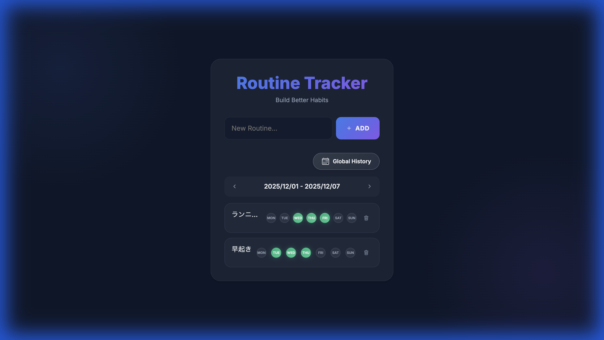

# アプリケーション設計書: Weekly Routine Tracker

## 1. 概要
「Weekly Routine Tracker」は、ユーザーが毎日の習慣（ルーチン）を管理し、達成状況を記録・可視化するためのWebアプリケーションです。週ごとのビューで日々の達成をチェックし、月間カレンダーで長期的な履歴を確認できます。

## 2. システム構成 (Tech Stack)
-   **Frontend**: HTML5, CSS3 (Vanilla), JavaScript (Vanilla)
    -   フレームワーク不使用の軽量設計
    -   レスポンシブデザイン (Mobile/Desktop対応)
-   **Backend**: Python (Flask)
    -   RESTful API設計
-   **Database**: SQLite
    -   ORM: SQLAlchemy

## 3. ディレクトリ構成
```
/
├── app.py              # アプリケーションエントリーポイント (API定義)
├── models.py           # データベースモデル定義
├── todos.db            # SQLiteデータベースファイル
├── templates/
│   └── index.html      # メインページHTML
└── static/
    ├── style.css       # スタイルシート
    └── script.js       # フロントエンドロジック
```

## 4. データベース設計

### 4.1 Routine (ルーチン)
ユーザーが管理したい習慣の単位。
| カラム名     | 型          | 制約     | 説明       |
| :----------- | :---------- | :------- | :--------- |
| `id`         | Integer     | PK       | 一意のID   |
| `title`      | String(100) | Not Null | ルーチン名 |
| `created_at` | DateTime    |          | 作成日時   |

### 4.2 RoutineLog (ルーチンログ)
特定の日付におけるルーチンの達成状況。
| カラム名     | 型         | 制約     | 説明                    |
| :----------- | :--------- | :------- | :---------------------- |
| `id`         | Integer    | PK       | 一意のID                |
| `routine_id` | Integer    | FK       | 親ルーチンのID          |
| `date_str`   | String(10) | Not Null | 日付文字列 (YYYY-MM-DD) |
| `completed`  | Boolean    |          | 完了フラグ (True/False) |

*制約*: `(routine_id, date_str)` の組み合わせはユニーク。

## 5. API定義

### ルーチン操作
-   `GET /api/routines?offset={n}`
    -   指定された週オフセットに基づいて、ルーチン一覧と週間達成状況を取得。
-   `POST /api/routines`
    -   新規ルーチンを作成。
    -   Body: `{ "title": "名前" }`
-   `PUT /api/routines/<id>`
    -   ルーチン名を更新。
    -   Body: `{ "title": "新しい名前" }`
-   `DELETE /api/routines/<id>`
    -   ルーチンを削除（関連するログも削除）。

### ステータス操作
-   `POST /api/routines/<id>/toggle`
    -   特定の日付の達成状態を切り替え（未完了⇔完了）。
    -   Body: `{ "date": "YYYY-MM-DD" }`

### 履歴参照
-   `GET /api/history/all`
    -   全ルーチンの全完了履歴を取得。グローバルカレンダー表示用。
-   `GET /api/routines/<id>/history?year={yyyy}`
    -   特定ルーチンの年間履歴を取得（将来のヒートマップ拡張用）。

## 6. フロントエンド機能

### 6.1 週間トラッカー (メイン画面)

-   **リスト表示**:
    -   1行目: ルーチン名 (クリックで編集可能)
        -   タイトルの下に十分なスペースを確保し、タスク名と完了状態を視覚的に分離。
    -   2行目: 曜日ごとの実績チェックボックス + 削除ボタン
-   **ユーティリティバー**:
    -   グローバル履歴ボタン (カレンダーアイコン) を独立表示。
    -   **デザイン改善**: グラデーションと影を用いたモダンな「Glassmorphism」風ボタンスタイル。
-   **週ナビゲーション**:
    -   `<` `>` ボタンで前週・翌週へ移動可能。
    -   過去の週に遡って実績入力が可能。
-   **ステータス入力**: 丸いインジケーターをクリックして完了/未完了を切り替え。
-   **編集・削除**:
    -   ルーチン名をクリックして名前を変更。
    -   ゴミ箱アイコンで削除。

### 6.2 グローバル履歴カレンダー (モーダル)

-   **月間カレンダー**: 全タスクの達成状況を一括で確認可能。
    -   達成がある日は青い丸が表示され、マウスホバーで件数を表示。
-   **インタラクティブフィルタ**:
    -   日付をクリックすると、その日に完了したタスクのみをリスト表示。
    -   もう一度クリックすると全履歴表示に戻る。
-   **履歴リスト**:
    -   日付ごとにグループ化された完了タスク一覧を表示。
    -   リストはスクロール可能で、画面サイズに応じて適切に収まるレイアウト。

## 7. UI/UX デザイン方針
-   **ダークモード**: ベースカラー `#0f172a` を基調とした目に優しい配色。
-   **グラスモーフィズム**: カード要素に半透明のぼかし効果 (`backdrop-filter`) を適用。
-   **インタラクション**:
    -   ホバー時のアニメーション、クリック時のフィードバックを重視。
    -   ルーチン名が長い場合は省略表示 (`...`) し、ホバーで全文表示。
