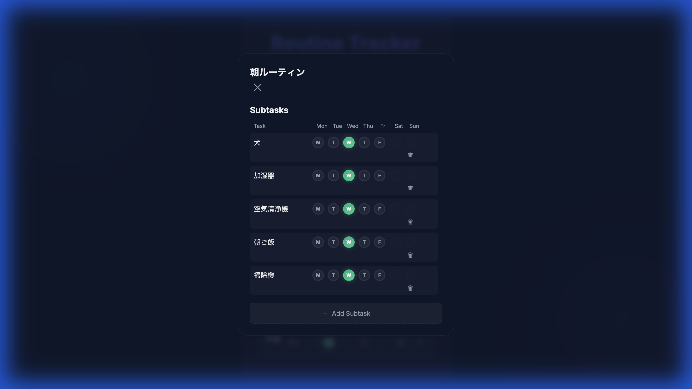
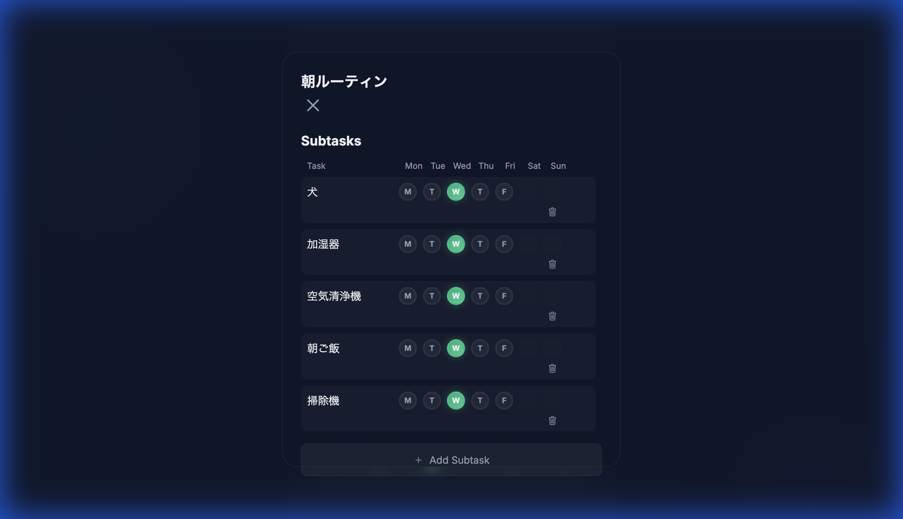

# アプリケーション設計書: Weekly Routine Tracker

## 1. 概要
「Weekly Routine Tracker」は、ユーザーが毎日の習慣（ルーチン）を管理し、達成状況を記録・可視化するためのWebアプリケーションです。週ごとのビューで日々の達成をチェックし、月間カレンダーで長期的な履歴を確認できます。

## 2. システム構成 (Tech Stack)
-   **Frontend**: HTML5, CSS3 (Vanilla), JavaScript (Vanilla)
    -   フレームワーク不使用の軽量設計
    -   レスポンシブデザイン (Mobile/Desktop対応)
-   **Backend**: Python (Flask)
    -   RESTful API設計
-   **Database**: SQLite
    -   ORM: SQLAlchemy

## 3. ディレクトリ構成
```
/
├── app.py              # アプリケーションエントリーポイント (API定義)
├── models.py           # データベースモデル定義
├── todos.db            # SQLiteデータベースファイル
├── templates/
│   └── index.html      # メインページHTML
└── static/
    ├── style.css       # スタイルシート
    └── script.js       # フロントエンドロジック
```

## 4. データベース設計

### 4.1 Routine (ルーチン)
ユーザーが管理したい習慣の単位。
| カラム名      | 型          | 制約     | 説明                             |
| :------------ | :---------- | :------- | :------------------------------- |
| `id`          | Integer     | PK       | 一意のID                         |
| `title`       | String(100) | Not Null | ルーチン名                       |
| `target_days` | String(20)  |          | 実施対象日 (例: "0,1,2,3,4,5,6") |
| `created_at`  | DateTime    |          | 作成日時                         |

### 4.2 RoutineLog (ルーチンログ)
特定の日付におけるルーチンの達成状況。
| カラム名     | 型         | 制約     | 説明                    |
| :----------- | :--------- | :------- | :---------------------- |
| `id`         | Integer    | PK       | 一意のID                |
| `routine_id` | Integer    | FK       | 親ルーチンのID          |
| `date_str`   | String(10) | Not Null | 日付文字列 (YYYY-MM-DD) |
| `completed`  | Boolean    |          | 完了フラグ (True/False) |

*制約*: `(routine_id, date_str)` の組み合わせはユニーク。

### 4.3 SubTask (サブタスク)
ルーチンを構成する細かいタスク単位。
| カラム名     | 型          | 制約     | 説明           |
| :----------- | :---------- | :------- | :------------- |
| `id`         | Integer     | PK       | 一意のID       |
| `routine_id` | Integer     | FK       | 親ルーチンのID |
| `title`      | String(100) | Not Null | サブタスク名   |
| `created_at` | DateTime    |          | 作成日時       |

### 4.4 SubTaskLog (サブタスクログ)
サブタスクの日毎の達成状況。
| カラム名     | 型         | 制約     | 説明                    |
| :----------- | :--------- | :------- | :---------------------- |
| `id`         | Integer    | PK       | 一意のID                |
| `subtask_id` | Integer    | FK       | 親サブタスクのID        |
| `date_str`   | String(10) | Not Null | 日付文字列 (YYYY-MM-DD) |
| `completed`  | Boolean    |          | 完了フラグ (True/False) |

*ロジック*: ルーチンにサブタスクが存在する場合、`RoutineLog` の達成状況は、その日の**全てのサブタスクが完了しているかどうか**によって自動的に決定されます（派生ステータス）。

## 5. API定義

### ルーチン操作
-   `GET /api/routines?offset={n}`
    -   指定された週オフセットに基づいて、ルーチン一覧、週間達成状況、および**サブタスク情報**を取得。
-   `POST /api/routines`
    -   新規ルーチンを作成。
-   `PUT /api/routines/<id>`
    -   ルーチン名を更新。
-   `DELETE /api/routines/<id>`
    -   ルーチンを削除（関連するサブタスク・ログも削除）。

### サブタスク操作
-   `POST /api/routines/<id>/subtasks`
    -   ルーチンにサブタスクを追加。
    -   Body: `{ "title": "サブタスク名" }`
-   `DELETE /api/subtasks/<id>`
    -   サブタスクを削除。
-   `POST /api/subtasks/<id>/toggle`
    -   サブタスクの達成状態を切り替え。親ルーチンの達成可否も再計算して返却。
    -   Body: `{ "date": "YYYY-MM-DD" }`

### ステータス操作
-   `POST /api/routines/<id>/toggle`
    -   特定の日付の達成状態を切り替え（サブタスクが無い場合のみ有効）。

### 履歴参照
-   `GET /api/history/all`
    -   全ルーチンの全完了履歴を取得。

## 6. フロントエンド機能

### 6.1 週間トラッカー (メイン画面)
-   **リスト表示**:
    -   ルーチン名をクリックすると**詳細モーダル**が開きます（インライン編集廃止）。
    -   曜日ごとの実績チェックボックスを表示。
    -   *注釈*: サブタスクがあるルーチンのチェックボックスは「派生ステータス」となり、点線で表示されクリック不可になります。
-   **操作性**:
    -   `prompt()` (ブラウザ標準) を廃止し、**カスタムモーダル**ですべての入力を処理（スマホでの挙動安定化のため）。

### 6.2 タスク詳細モーダル (新機能)
-   **概要**: ルーチン名をクリックすると開く詳細画面。
-   **スクリーンショット**:
    -   **Desktop View** (横並びグリッド):  
        
    -   **Mobile View** (縦並びカード):  
        
-   **機能**:
    -   **ルーチン名編集**: タイトルをクリックして変更。
    -   **サブタスク管理**:
        -   サブタスクの追加・削除。
        -   サブタスクごとの曜日別チェックボックス（クリックでトグル）。
        -   **レスポンシブ対応**:
            -   Desktop: 横並びグリッドレイアウト。
            -   Mobile: 縦並びカードレイアウト（曜日イニシャル表示）。
    -   **スクロール対応**: サブタスクが増えても画面外にはみ出さないようスクロール可能。

### 6.3 グローバル履歴カレンダー
-   月間カレンダーで全体の達成状況を確認可能。

## 7. UI/UX デザイン方針
-   **ダークモード**: ベースカラー `#0f172a` を基調。
-   **グラスモーフィズム** & **レスポンシブ**: モバイルファーストな設計思想を取り入れ、スマホでもPCでも快適に操作可能。
